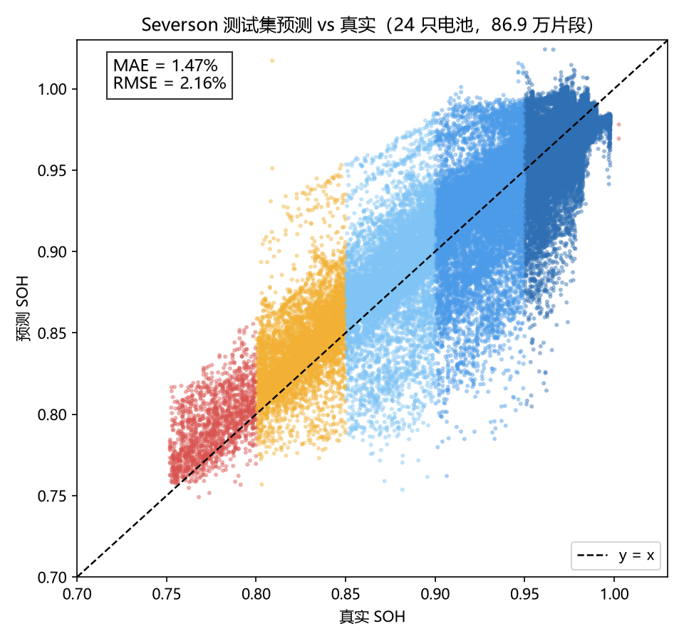
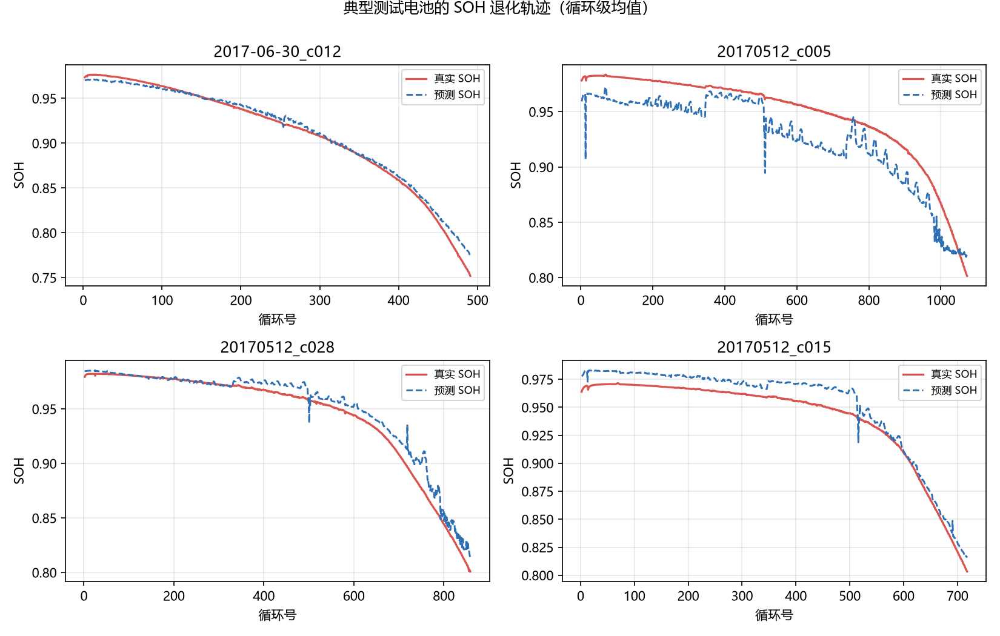
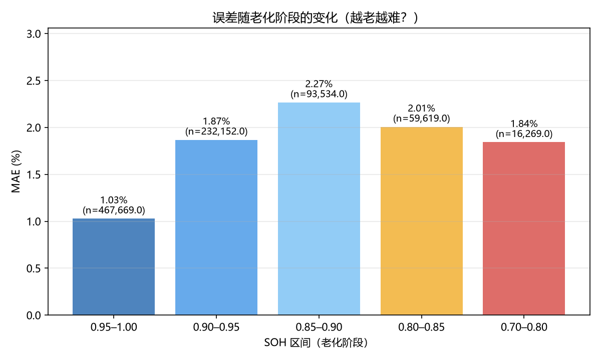
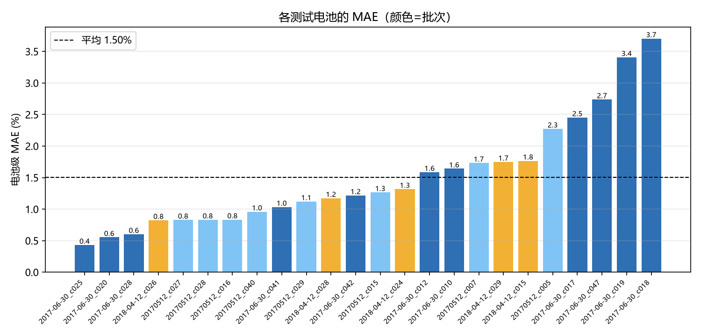
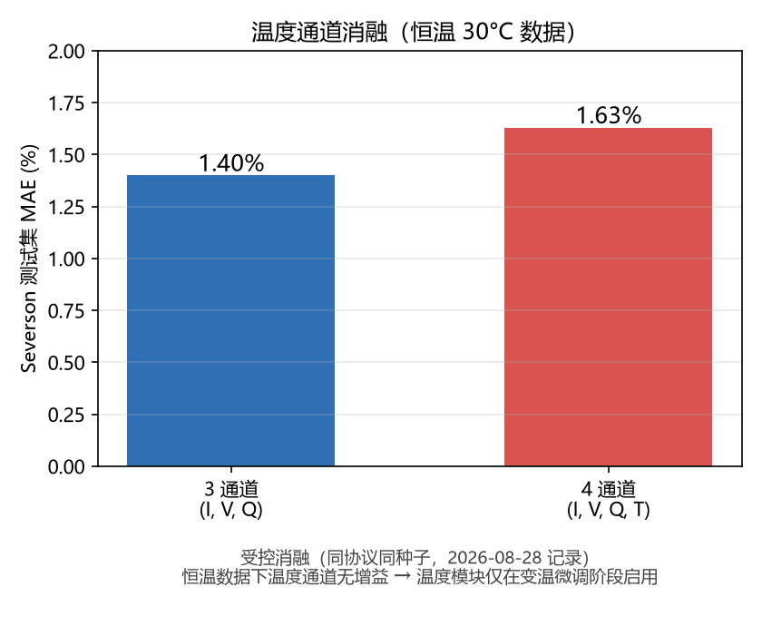

# 第 5 章 实验与验证（草稿 v0.1）

> 状态：草稿。除标注【待补】外，所有数字均已由运行日志 / 指标 JSON 核对。
> 本章只放实验结果与结论，方法细节见第 4 章。

---

## 5.1 实验设置

### 5.1.1 数据集与角色

| 数据集 | 电池 | 规格 | 温度 | 角色 |
| :--- | :--- | :--- | :--- | :--- |
| Severson（MATR） | 123（质量过滤后） | 1.1 Ah 18650 LFP | 30°C 恒温 | 阶段一预训练 |
| SIT | 20 | 50 Ah 方形 LFP | 环境温 / 40°C 恒温箱 | 阶段二跨电芯 / 车辆微调 |

SIT 的 20 只电池按测试设备分为四个子集，环境温组与 40°C 恒温箱组各 10 只：

| 设备 | 温度组 | 电池编号 | 数量 |
| :--- | :--- | :--- | :--- |
| Repower_001 | 环境温 | 001-1 ~ 001-8 | 8 |
| Chroma_101 | 环境温 | 101-1, 101-3 | 2 |
| Repower_002 | 40°C 恒温箱 | 002-1, 002-2, 002-3, 002-4, 002-5, 002-7 | 6 |
| Repower_003 | 40°C 恒温箱 | 003-1, 003-3, 003-5, 003-7 | 4 |

针对 SIT 数据集，我们做了四项与 Severson 不同的数据标定处理：

**格式统一与温度清洗**。SIT 原始数据为每循环一个 xlsx（Charge / Discharge 两个 sheet）、每电池一个 Cycle_Summary CSV，温度由 MTV 列记录。我们将其转换为与 Severson 完全一致的统一循环结构（电流、电压、容量坐标、时间、温度五条序列），使下游片段切分、插值、训练代码对两个数据集无差别处理。温度列的清洗规则为：Chroma 设备有两路热电偶时取首个有效列，个别循环温度列全为 NaN 时用电池级中位数兜底（这类循环约占总循环的少量比例）。

**SOH 标签口径更改**。SIT 的 SOH 标签采用"当前循环充电容量 / 该电池最大充电容量"（Qc / Qc_max），与 Severson 的"充电容量 / 标称容量 1.1 Ah"口径不同——原因是 SIT 为 50 Ah 方形电芯，充电容量可达 52~55 Ah、没有统一的标称容量参考，以电池自身最大充电容量为参考更贴近 BMS 的实际标定方式。两套口径已在 4.1.1 说明，本实验的所有结论均在同一口径内比较。

**SOH 剪切**。SIT 电池的衰减深度差异极大：20 只电池中有 12 只最低 SOH 低于 0.75，部分电池甚至衰减至 0.06~0.20（如 001-8、101-3、003-5），远超实车正常服役区间。为对齐 BMS 正常工作范围并与 Severson 预训练的健康分布（绝大多数样本 SOH > 0.8）保持一致，本工作在所有实验中剔除 SOH < 0.75 的循环，约占 SIT 总循环的 15%。这一处理同时避免实验室加速老化特有的"跌崖式"深退化段主导误差统计，使结论聚焦于实车可观测的服役区间。

**环境温组与实车自然充电的对应关系**。环境温组（001/101）在不受控的室温下循环，实测片段温度在约 25~58°C 间波动（环境温度与充电自热叠加），与实车用户在不同季节、不同停放环境下的自然充电场景相近；结合"随机起点 + 部分充电片段"的观测方式（模拟用户随时插拔充电枪、每次只充一部分），环境温组可近似视为实车的自然充电过程。需要说明的边界是：SIT 仍为实验室固定充放电协议，不含真实驾驶的动态电流谱；40°C 恒温箱组则代表理想化恒温测试基准，用于验证模型在温度水平变化下的鲁棒性。

**分组与车辆微调协议**。每只电池包含数百至近千个循环；车辆级实验中，用每只电池前 300 个循环微调、之后循环测试。片段切分（20% 容量窗口、最多 51 个起点、101 个等容量点）与 12 维温度形状特征提取与 Severson 完全一致，输入经跨电芯归一化（电流 → C-rate、容量坐标 → SOC），保证 1.1 Ah 与 50 Ah 电芯共用同一模型。

### 5.1.2 评估协议与指标

- **协议一（同分布）**：Severson 质量过滤后 123 只电池，按电池级随机划分（seed 42）99 训练 / 24 测试，无验证集，检验预训练模型在其数据分布内的精度；
- **协议二（跨电芯少样本）**：Severson 预训练 → SIT 若干电池微调 → 其余 SIT 电池测试，检验"见过多协议 LFP、未见 50 Ah 大电芯"的迁移能力；
- **协议三（车辆级部署模拟）**：目标车辆前 300 循环微调 → 未来循环测试，检验"部署到一辆车后用其自身历史校准"；
- **指标**：MAE（主指标）、bias（系统性偏差，安全相关）、去偏 MAE（扣掉系统偏差后的散度）、Pearson 相关系数。

训练/测试按**电池级划分**，同一电池的所有片段不跨集合（防泄漏）。

> 口径说明：Severson 扩展数据集共 138 只电池；本工作沿用 Scientific Reports 2026 的
> 123 只电池口径（数据质量过滤后），划分名单论文未公开，采用 seed=42 的电池级随机划分。

## 5.2 同分布基线：Severson 预训练模型精度

阶段一模型在其自身测试集（未见电池）上的 SOH 估计精度：

| 输入通道 | 预训练 loss | 测试 MAE | 说明 |
| :--- | :--- | :--- | :--- |
| 3 通道（I, V, Q） | 0.00027 | **1.47%** | 实际部署模型（normalized_3ch.pt 实测） |
| 4 通道（+T 通道） | 0.00027 | 1.63% | 受控消融记录（README 8/28） |

结论：模型在其训练分布内已具备良好精度（~1.5%）；4 通道在恒温 Severson 上无增益，佐证"温度模块应只在变温微调阶段启用"的设计。

图 5-1 给出测试集（24 只未见电池、86.9 万片段）的预测-真实散点：绝大多数点紧贴 45° 线，MAE=1.47%、RMSE=2.16%。图 5-2 展示四只代表性测试电池的 SOH 轨迹——健康慢衰与带拐点的深度退化电池均被模型跟踪良好。图 5-3 按真实 SOH 分桶统计误差：健康区（0.95–1.0）误差仅 1.03%，在拐点区（0.85–0.90）升至峰值 2.27%，随后深退化区（<0.85）回落至约 1.8–2.0%——模型在未见电池上没有发散，但在拐点附近最吃力，这一现象与 5.8 的外推 bias 分析相互印证。图 5-4 显示各测试电池的电池级 MAE（平均 1.50%），误差来源集中于少数深退化/特殊协议电池。图 5-5 对比恒温数据下 3 通道与 4 通道输入的受控消融（1.40% vs 1.63%），温度通道无增益，支撑"温度模块仅在变温微调阶段启用"的设计。

> 数字口径：1.47% 为 `normalized_3ch.pt`（实际部署模型）在当前测试索引上的实测值；
> 1.40% / 1.63% 为 2026-08-28 受控消融（同协议同种子，只开关温度通道）的 README 记录，
> 该消融的 3 通道 checkpoint 未保留，故表格以实测 1.47% 为准。

## 5.3 跨电芯迁移价值（Severson → SIT 50 Ah）

同样在 14 只 SIT 电池上训练（30 epochs、SOH>0.75 过滤），对比两种初始化：

| 配置 | 测试 MAE | bias | Pearson r |
| :--- | :--- | :--- | :--- |
| C：Severson 预训练 + SIT 微调 | **4.01%** | −1.15% | 0.356 |
| B：SIT 从头训练（随机初始化） | 6.76% | −6.03% | 0.261 |

结论：预训练带来 **2.75pp** 的 MAE 优势，更关键的是 bias 从 −6.03% 收窄到 −1.15%——预训练提供了**绝对 SOH 标定**（Severson 教会模型"这段曲线大致对应多健康"），从头训练则缺少这个锚点。

> TODO：数字来自 8/25 运行记录（模型 `sit_fewshot_14cell_C/B_soh075.pt`），建议用固定协议复核一次并落盘 JSON。

## 5.4 车辆级部署模拟（前 300 循环 → 未来）

三辆 SIT 电池，用各自前 300 循环微调、预测未来循环（SOH > 0.75 过滤）：

| 电池 | 温度组 | 训练 SOH 范围 | 测试 SOH 范围 | MAE | bias | 去偏 |
| :--- | :--- | :--- | :--- | :--- | :--- | :--- |
| 001-2 | 环境温 | 0.907–1.000 | 0.859–0.921 | 3.51% | +3.48% | 1.99% |
| 002-3 | 40°C 恒温箱 | 0.935–1.000 | 0.899–0.946 | 3.34% | +3.34% | 1.40% |
| 001-7 | 环境温 | 0.914–1.000 | 0.861–0.929 | 3.34% | +2.97% | 3.59% |
| **平均** | — | — | — | **3.40%** | — | 2.33% |

配置：温度形状特征 + 物理约束，30 epochs，seed 42。

观察：测试段 SOH 全部低于训练段（外推），三辆车的 bias 均为正——模型系统性高估健康度，这是"外推区"的典型表现，物理约束与边界分析见 5.6 / 5.7。

## 5.5 温度模块消融

固定其余配置，只开关温度形状特征嵌入：

| 电池 | 无温度 | +温度形状特征 | 差异 |
| :--- | :--- | :--- | :--- |
| 001-2 | 4.01% | 3.86% | −0.15pp |
| 002-3 | 3.69% | 3.08% | **−0.61pp** |
| 001-7 | 5.35% | 4.34% | **−1.01pp** |
| **平均** | 4.35% | 3.76% | **−0.59pp** |

结论：温度形状特征在**三辆车上均带来增益**（平均 −0.59pp），且在温度摆动最大的 001-7 上收益最大（−1.01pp）——形状特征（而非均值标量）确实把"温度如何变化"的信息传给了决策层。

> 注：5.5 的对比全部为"无物理约束"配置（λ=0），保证温度效应被单独隔离。

## 5.6 物理约束消融

固定温度形状特征，只开关物理约束三件套（λ=0.1）：

| 电池 | 无物理约束 | +物理约束 | 差异 |
| :--- | :--- | :--- | :--- |
| 001-2 | 3.86% | 3.51% | −0.35pp |
| 002-3 | 3.08% | 3.34% | +0.26pp |
| 001-7 | 4.34% | 3.34% | **−1.00pp** |
| 平均 | 3.76% | 3.40% | −0.36pp |

结论：物理约束平均带来 0.36pp 收益，最大收益出现在温度摆动最大的 001-7（−1.00pp，从垫底变为并列最优）——约束把"循环内一致性 + 单调退化"先验注入，压住了片段噪声驱动的非物理外推；在轨迹本身平滑的恒温箱车（002-3）上小幅回退，属于约束与标签噪声的权衡。

### 5.6.1 温度 × 物理双因素（以 001-7 为例）

| 001-7 | 无物理约束 | +物理约束 |
| :--- | :--- | :--- |
| 无温度 | 5.35% | 5.24% |
| +温度形状特征 | 4.34% | **3.34%** |

两个模块互补：物理约束单独作用收益有限（−0.11pp），温度特征单独作用 −1.01pp，两者叠加 −2.01pp。物理约束压制了温度摆动引入的片段噪声，使温度特征的优势得以完全释放。

## 5.7 温度分组与变温验证

针对赛题"不同温度下的多维验证"，按温度组汇总：

| 温度组 | 电池 | 温度范围（片段 T_mean） | MAE（最终配置） |
| :--- | :--- | :--- | :--- |
| 40°C 恒温箱 | 002-3 | 39.3–47.2°C | 3.34% |
| 环境温（大摆动） | 001-2 | 25.3–58.2°C | 3.51% |
| 环境温（大摆动） | 001-7 | 24.5–49.7°C | 3.34% |

初步结论：模型在恒温与变温场景均能保持 ~3.3–3.5% 的精度，说明温度模块+物理约束把跨温度差异吸收进决策层。

## 5.8 边界分析

### 5.8.1 外推 bias（老化阶段泛化）

车辆协议天然构成"健康区训练 → 退化区测试"的外推：训练 SOH 均 ≥ 0.91，测试最低至 0.86。三辆车 bias 均为正（+2.97% ~ +3.48%），即**预测普遍偏高**——这是数据驱动模型外推的固有缺陷（训练分布内未见深度退化）。物理约束压制了非物理回升，但无法完全消除水平偏移；工程上可用车辆历史做 bias 校正。

补充证据（零样本）：无温度配置下，Severson 预训练模型**不微调**直接在 SIT 车辆未来段评估为 MAE 8.37%（bias −2.50%）——跨电芯、零样本即可工作，车辆微调后降至 5.35%，说明"通用预训练 → 车辆校准"的有效性。

### 5.8.2 温度剧烈摆动场景

001-7 的片段 ΔT 范围 −4.9~6.5°C，是所有车中温度形状噪声最大的：温度模块单独使用时误差最大（4.34%），叠加物理约束后降至 3.34%。说明在传感器噪声/温度摆动大的场景，单一温度特征不可靠，需要循环级约束兜底。

### 5.8.3 传感器噪声鲁棒性【待补】

> TBD：对测试片段注入高斯噪声（V ±σ、I ±σ、T ±σ），报告 MAE 随噪声水平的变化，直接对应赛题"非理想工况（传感器噪声）"评分点。

---

## 5.9 本章小结（待定稿）

- 同分布基线 1.47%（实际部署模型实测；受控消融 3ch=1.40% vs 4ch=1.63%）；
- 跨电芯迁移带来 2.75pp 收益，bias 收窄 4.88pp；
- 车辆级部署模拟平均 MAE 3.40%；
- 温度形状特征在三辆车全部有效（平均 −0.59pp），物理约束平均再降 0.36pp，二者互补；
- 局限：外推 bias 仍为正，需 bias 校正或更多深度退化数据。
